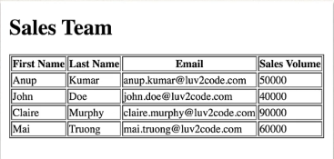

## Sales Team Table
**Step 1: Create a New Project**
- `ng new sales-project` creates Angular project
  - no angular routing
  - CSS for style sheet format
- `ng serve --open` runs project & opens project

**Step 2: Update Main Template Page**
- Clean up `app.component.html` file
  - Deleted placeholder content
  - Added h1 tag with title "Sales Team"

**Step 3: Generate a New Component**
- `ng generate component sales-person-list`
  - Creates files for new component

**Step 4: Add New Component Selector to App Template Page**
- Copied component selector from `sales-person-list.component.ts`
- Added component selector as a tag into `app.component.html`

**Step 5: Generate a `SalesPerson` class**
- `ng generate class sales-person-list/SalesPerson` generates class
- `sales-person.ts` contains `SalesPerson` class
  - Defined constructor & used parameter properties to define class

**Step 6: Create Sample Data in `SalesPersonListComponent.ts`**
- Created array of sales person objects
  - Included 4 sales person objects

**Step 7: Build HTML Table Using Sample Data**
- `sales-person-list.component.html` 
  - Loop over array of sales person objects & populated each object in table
  - Table displays first & last name, email, sales volume

**Current Table**

## Integrating Angular & Bootstrap CSS
Step 1: Add Bootstrap Files
- Added remote Bootstrap Files to `index.html` 